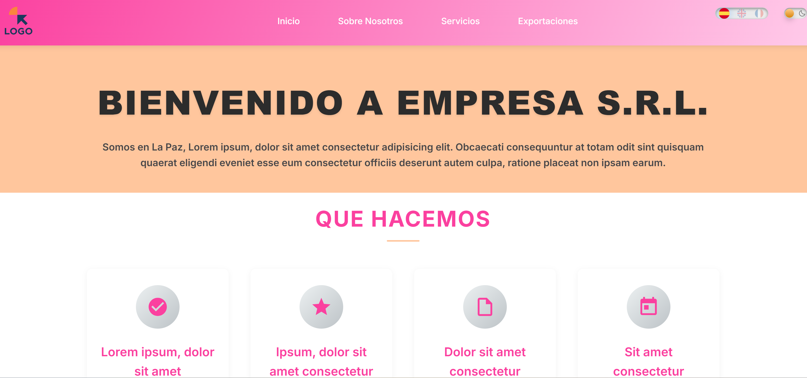

# 📌 Responsive SPA application with HTML, CSS, and JS

## Responsive web application with dark/light mode, multilingual (English/Spanish/French), and email sending. Customized with CSS (menus 3 levels).

Click  <a href="README-es.md">here</a> to view the Spanish version

### Description

A Single Page Application (SPA) built with HTML, CSS, and JavaScript, featuring EmailJS integration for contact forms, multi-language support (Spanish, English, and French), and multiple styled sections. This conversational landing page includes a hero section, trust section, about section, what we do section, and more, along with a contact form. The menu navigates to different sections, including team pages and other relevant content.
 

You can visit the online platform at [https://respo-spa-polyglot.vercel.app/](https://respo-spa-polyglot.vercel.app/)

## Technologies Used

- **SPA**: Single Page Application architecture using vanilla JavaScript for dynamic content loading.
- **EmailJS**: For handling contact form submissions and email sending.
- **Multiple Languages**: Support for 3 languages: Spanish (es), English (en), and French (fr).
- **CSS**: Custom styling for various sections including responsive design.
- **Menú:**  3-level navigation menu, optimized for a smooth user experience on desktop and mobile devices

## Features

- Multiple sections with distinct CSS styling
- Internationalization support for es/en/fr
- Contact form with EmailJS integration
- Responsive design

## Installation

1. Clone this repository
2. Open in a web server (e.g., via XAMPP at localhost)
3. Configure EmailJS credentials in `assets/js/main.js`

## Usage

Open `index.html` in your browser to view the application.

## Assets

- CSS: `assets/css/style.css`
- JavaScript: `assets/js/main.js`
- Images: Located in `assets/img/`

## 📜 License
MIT License - You can use this code freely for personal and commercial projects.

## 🤝 Contribute
Fork the project
Create your feature branch (git checkout -b feature/AmazingFeature)

Commit your changes (git commit -m ‘Add some AmazingFeature’)

Push to the branch (git push origin feature/AmazingFeature)
Open a Pull Request

## 🚀 AUTHOR
👤 Favian Medina Gemio

| Resource     | Address                            |
|--------------|---------------------------------------------------------------------------------------------------|
|📧 Email     |[favian.medina.gemio@gmail.com](favian.medina.gemio@gmail.com)                                      |
|💻 GitHub    |[https://github.com/fabinnerself](https://github.com/fabinnerself)                       |
|🧠 LinkedIn  |[https://www.linkedin.com/in/favian-medina-gemio/](https://www.linkedin.com/in/favian-medina-gemio/)|
|💼 Portfolio |[https://favian-medina-cv.vercel.app/](https://favian-medina-cv.vercel.app/)|
 

(c) 2025